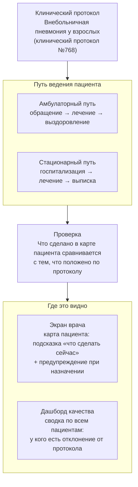

# 1. Ландшафт целиком

Одна картинка: откуда берётся протокол, как по нему ведут пациента, кто это проверяет и где это видно врачу.

## Что говорить врачу, глядя на схему

1. В основе всего — один клинический протокол лечения внебольничной пневмонии у взрослых. Это не наша выдумка, а официальный документ; система просто помогает его соблюдать.
2. Пациент проходит по одному из двух путей: амбулаторно (лечится дома, ходит на приём) или в стационаре (госпитализирован). Это два разных сценария, дальше на схеме №2 они показаны отдельно.
3. На каждом шаге пути система не просто хранит записи — она **сравнивает** то, что реально сделано и назначено, с тем, что предписывает протокол.
4. Результат этого сравнения показывается врачу в двух местах: на экране конкретного пациента (что делать сейчас, есть ли отклонение) и на общем дашборде качества (у кого из пациентов клиники сейчас есть несоответствие протоколу).
5. Дашборд качества — это не «отдельная программа для начальства», это тот же самый механизм проверки, только собранный по всем пациентам сразу.
6. Если что-то на этой схеме выглядит как «программа решает за врача» — это не так: система подсказывает и предупреждает, финальное решение всегда за врачом (подробно — схема №4).
7. Дальше по демо: сначала путь пациента (схема 2), потом что хранится в карте (схема 3), потом как именно устроена проверка (схема 4), и в конце — как это выглядит на экране (схема 5).
