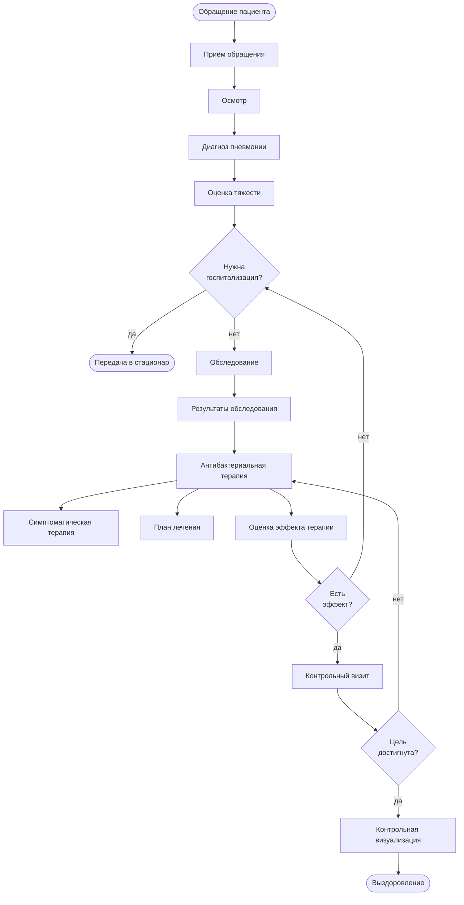
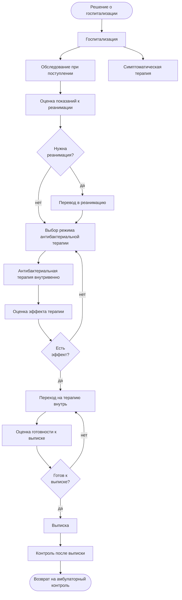

# 2. Путь пациента: амбулаторно и стационар

Два сценария ведения внебольничной пневмонии у взрослого. На схемах — только этапы и развилки, без списка анализов и доз (это отдельный документ, протокол; здесь — что происходит и в какой момент принимается решение).

**Как объяснять путь в целом:** сначала визит
([`care-outpatient-mature.bpmn`](../bpmn/care-outpatient-mature.bpmn)), затем контроль
([`care-outpatient-control-mature.bpmn`](../bpmn/care-outpatient-control-mature.bpmn)).
Две схемы вместо одной «паутины»: повторный приход = снова визит; решения контроля —
отдельные исходы. Конкретные болезни не меняют эту дорогу: протоколы только проверяют
назначения и контроль.

## 2.1 Амбулаторный путь (лечение дома)

Развилка «Есть эффект?» — это оценка через 2–3 суток лечения: если лихорадка и другие признаки не проходят, врач возвращается к вопросу о смене терапии или госпитализации, а не продолжает то же лечение вслепую.

## 2.2 Стационарный путь (госпитализация)

## Что говорить врачу, глядя на схемы

1. Это два разных сценария одного и того же заболевания — амбулаторный и стационарный; переход между ними — не «две программы», а одна передача с зафиксированным решением о госпитализации.
2. Развилки на схеме — это ровно те моменты, где протокол требует принять клиническое решение (госпитализация, реанимация, эффект терапии, готовность к выписке). Система не принимает решение сама — она напоминает, что оно назрело, и показывает, на что смотреть.
3. «Есть эффект?» встречается в обоих путях — это оценка через 2–3 суток после начала антибиотика. Если эффекта нет, путь возвращается назад: смена терапии или усиление, а не «дотерпеть».
4. В стационаре после улучшения — переход с внутривенного введения на приём внутрь, и только после этого оценивается готовность к выписке; выписка не происходит по одному хорошему дню.
5. После выписки пациент не «пропадает из вида»: предусмотрен контроль после выписки, который возвращается в амбулаторный путь — тот же протокол ведёт эпизод до конца, а не только госпитализацию.
6. Каждый прямоугольник и каждая развилка на этих упрощённых схемах существуют и в BPMN-диаграммах для Camunda — там путь собран **фазами** (подпроцессами): на верхнем уровне несколько крупных блоков, а шаги открываются двойным кликом внутри фазы.

## Оригиналы диаграмм (для точного показа в Camunda)

Полноценные BPMN-диаграммы (стандарт BPMN 2.0). Подписи на русском, без технических терминов — можно показывать напрямую. Верхний уровень — фазы ведения; детали — внутри фазы.

| Путь | Файл | Открыть в Camunda Modeler |
|---|---|---|
| **Амбулаторный визит** (главная) | [`docs/bpmn/care-outpatient-mature.bpmn`](../bpmn/care-outpatient-mature.bpmn) | см. `docs/explain/README.md` |
| **Контроль** | [`docs/bpmn/care-outpatient-control-mature.bpmn`](../bpmn/care-outpatient-control-mature.bpmn) | исходы — концы, без паутины |
| Амбулаторная / стационарная пневмония (пример болезни) | ниже Mermaid + `cap-*-mature.bpmn` | для разбора конкретного протокола |
| Железодефицитная анемия (пример) | `docs/bpmn/ida-outpatient-mature.bpmn` | вторично |
