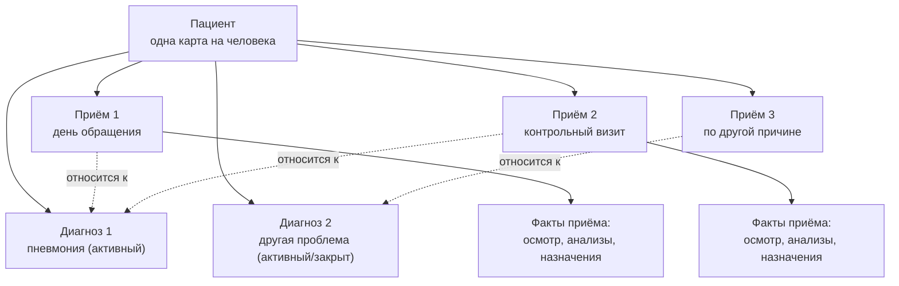

# 3. Карта пациента: что с чем связано

Самая частая путаница у тех, кто первый раз смотрит систему: «приём» и «диагноз» — это не одно и то же, и не вложены друг в друга.

## Что говорить врачу, глядя на схему

1. У пациента одна карта, а не «карта на диагноз» и не «карта на приём» — все диагнозы и все приёмы лежат в ней рядом, а не один внутри другого.
2. Диагноз и приём — два разных объекта с разной жизнью. Диагноз (например, пневмония) живёт, пока болезнь не разрешилась — это может быть несколько недель. Приём — это один конкретный контакт с врачом: один день, один визит.
3. Под одним диагнозом может быть много приёмов: обращение, потом контрольный визит через несколько дней, потом ещё один — все они относятся к одному и тому же эпизоду болезни. «Приём», «обращение», «визит» в системе — одно и то же понятие (один контакт с врачом в один день); отдельной, более крупной сущности «обращение» над несколькими приёмами в системе нет — роль такого «крупного контейнера» на несколько приёмов уже играет диагноз (п. 2). В списке приёмов на карте это видно буквально: заголовок списка — «Приёмы» с их количеством, а не дата одного из них, чтобы не выглядело, будто один приём вложен в другой.
4. Осмотр, анализы, назначения — это факты, которые всегда привязаны к конкретному приёму, а не «висят просто в карте». Именно поэтому система точно знает, что было сделано и когда, а не только «в целом что-то было».
5. Закрытие приёма и закрытие диагноза — это два разных действия врача, и они не совпадают по времени. Приём закрывают в конце каждого контакта («на сегодня я закончил с пациентом»). Диагноз закрывают отдельно, когда болезнь клинически разрешилась — часто это происходит на одном из контрольных визитов, а не в момент самого визита.
6. Если у пациента появляется новая, не связанная проблема — это новый диагноз и новый приём, а не дозапись в старую историю пневмонии. Старая история остаётся отдельно и видна отдельно.
7. Один приём может относиться сразу к двум диагнозам (например, пациент пришёл с одной жалобой, а на осмотре обнаружили и вторую проблему) — это не ошибка и не дублирование записи, просто один визит относится к двум историям болезни одновременно.
