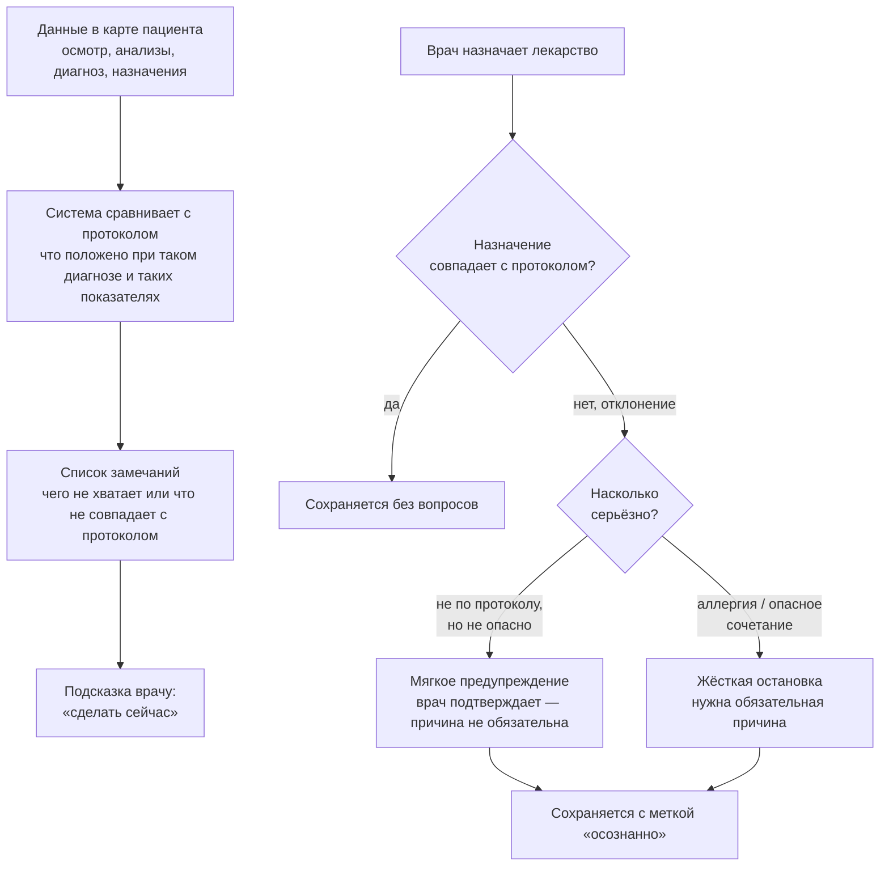

# 4. Как система проверяет протокол

Не BPMN (это не бизнес-процесс), а логика одной проверки: что система делает с данными, которые уже есть в карте, и что показывает врачу.

## Что говорить врачу, глядя на схему

1. Проверка происходит не по расписанию и не по кнопке — система пересчитывает картину сразу после любой записи, которая может повлиять на протокол: новый показатель, новый диагноз, новое назначение, новый результат обследования.
2. Результат проверки — это не «зачёт/незачёт» одним словом, а список конкретных замечаний: чего не хватает (например, не заказан нужный анализ) или что не совпадает с протоколом (например, антибиотик не первой линии). Каждое замечание превращается в понятную подсказку, что сделать сейчас.
3. Отдельная, более быстрая проверка происходит в момент назначения лекарства — до того, как назначение сохранится, а не после. Это как подсказка на кассе, а не ревизия через месяц.
4. Есть два уровня отклонения при назначении, и они ведут себя по-разному:
   - **мягкое предупреждение** — назначение не соответствует протоколу, но не представляет прямой опасности (например, есть более предпочтительный препарат первой линии). Врач может согласиться с назначением одним подтверждением, объяснять причину не обязательно;
   - **жёсткая остановка** — есть аллергия или опасное сочетание. Здесь одного подтверждения недостаточно: система требует, чтобы врач явно написал причину, по которой всё равно назначает препарат.
5. Важно: если врач подтвердил назначение вопреки предупреждению — это **не** делает картину пациента «зелёной». Отклонение остаётся видно и на карте, и в общей статистике по клинике, просто с пометкой «осознанное решение врача», а не «ошибка ввода». Система не скрывает решение врача, а честно его учитывает.
6. Смысл всей этой цепочки — не запретить врачу отклоняться от протокола (иногда это правильное клиническое решение), а сделать так, чтобы отклонение было **видно и осознанно**, а не потерялось в потоке рутинных записей.
