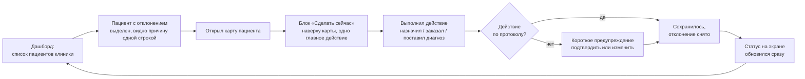

# 5. Что видит врач в интерфейсе

Путь пользователя — от общего списка пациентов до исправления одного конкретного отклонения. Без вёрстки и технических обозначений — только то, что реально видно на экране.

## Что говорить врачу, глядя на схему

1. Всё начинается с одного экрана — списка пациентов клиники, где сразу видно, у кого есть отклонение от протокола, а не только имя и дата приёма.
2. Причина отклонения написана человеческим языком прямо в списке — не нужно открывать карту, чтобы понять, что случилось: «не назначен антибиотик», «нет обследования», «пропущен контроль».
3. Внутри карты пациента подсказка не спрятана среди форм внизу страницы — она наверху, в отдельном блоке «Сделать сейчас», и там ровно одно главное действие, а не длинный список из десяти пунктов.
4. Врач выполняет само действие — назначает препарат, заказывает исследование, ставит диагноз — обычным образом, как и любую другую запись в карте.
5. Если действие соответствует протоколу — оно просто сохраняется, отклонение по этому пункту снимается автоматически, без отдельного шага «отметить как выполненное».
6. Если действие отклоняется от протокола — врач сразу видит короткое предупреждение и решает: подтвердить своё решение (иногда это правильно) или изменить назначение. Никакого перехода на другой экран для этого не нужно.
7. Статус на экране обновляется сразу после сохранения — врач не должен обновлять страницу или ждать, чтобы увидеть, что подсказка исчезла или изменилась.
8. Возврат на общий дашборд показывает актуальную картину: если отклонение снято, пациент больше не выделен по этой причине; если осталось другое — оно будет видно.
