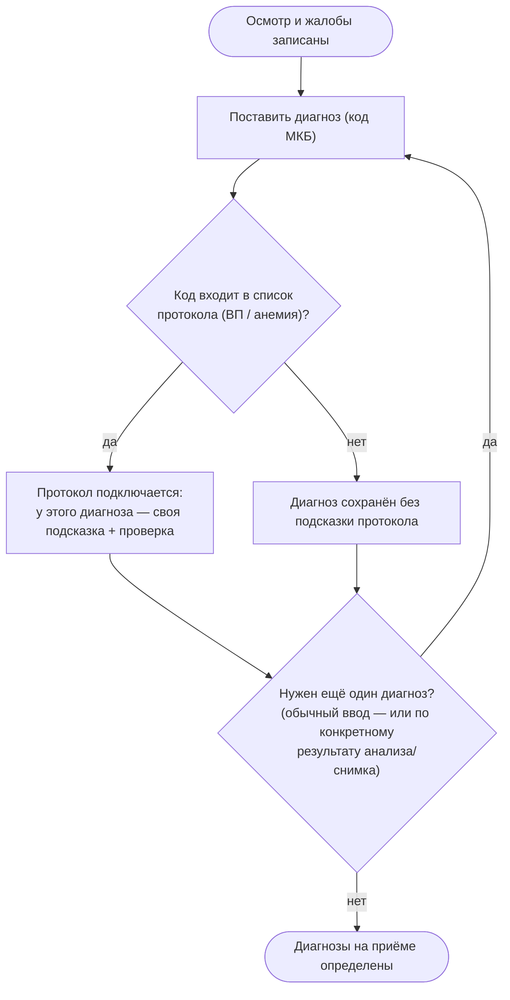
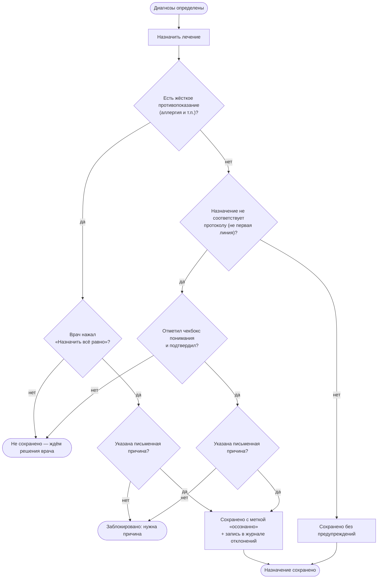
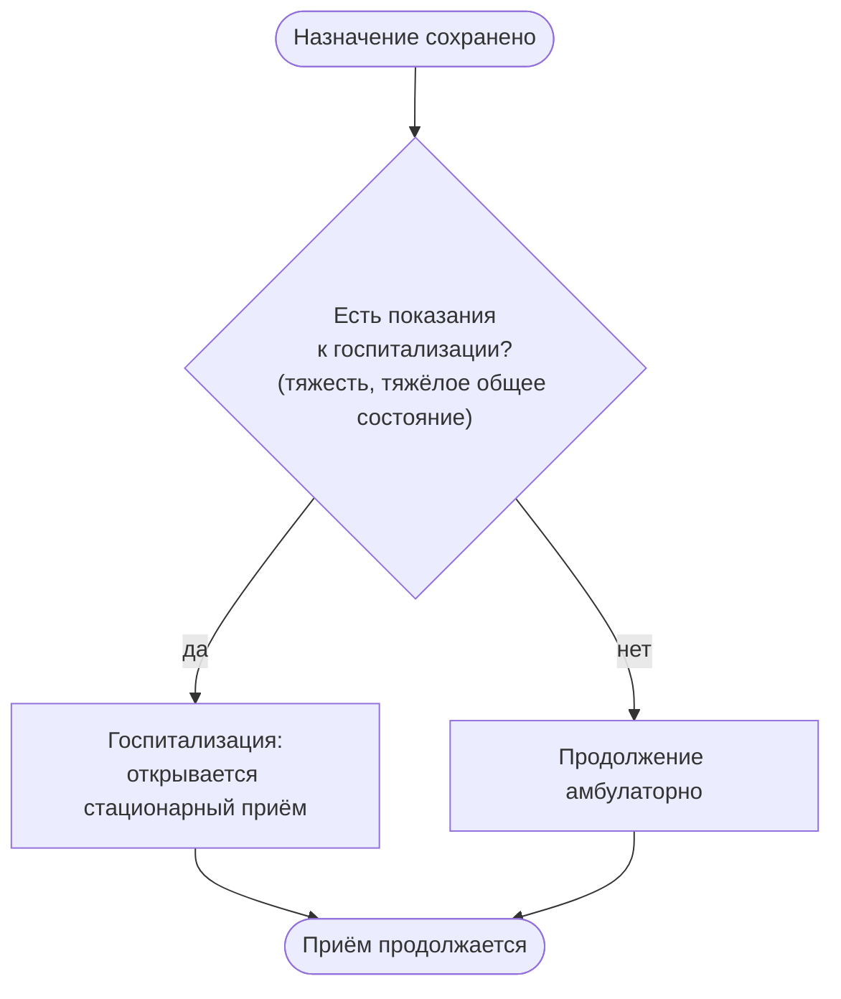
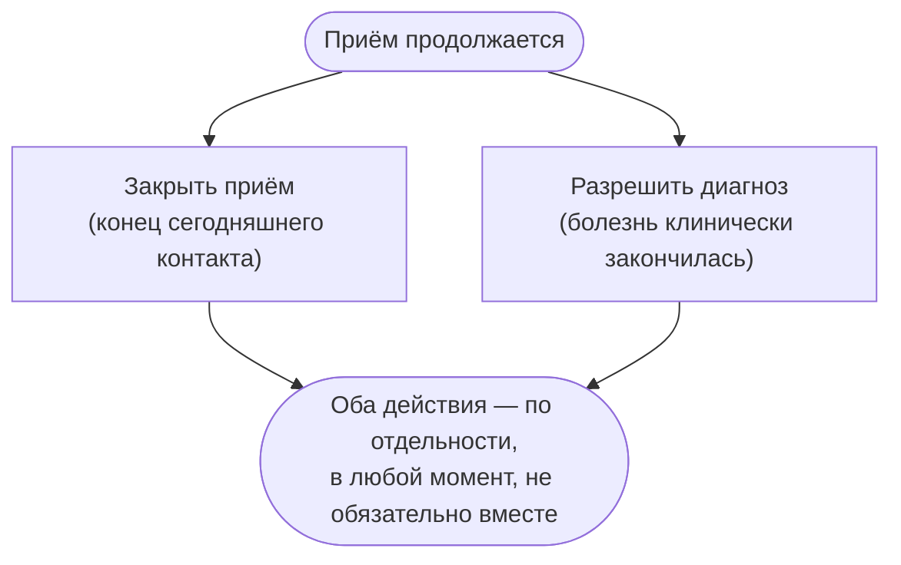

# 6. Диагноз, дополнительный диагноз и проверка при приёме — детально

Схемы 1–5 в этой папке показывают общую картину. Здесь — увеличенный «врачебный лог» одного приёма: что происходит, когда врач ставит диагноз, ставит **ещё один** диагноз (например, по результату анализа), назначает лечение и решает вопрос госпитализации. Каждая развилка ниже проверена по коду, а не додумана — она соответствует реальному поведению системы на сегодня.

**Важное сразу:** система не ждёт, пока приём закончится, чтобы проверить протокол. Каждая проверка ниже пересчитывается **сразу после** записи — так же, как описано в схеме 4.

## 6.1 Диагноз и дополнительный диагноз

**Что говорить врачу:**

1. Диагноз ставится кодом МКБ, не свободным текстом — это то, что система умеет сравнивать с протоколом.
2. Если код входит в список протокола (сейчас — внебольничная пневмония и железодефицитная анемия), у этого диагноза сразу появляется своя подсказка и проверка. Если код в список не входит — диагноз просто хранится в карте, без подсказки.
3. Диагнозов на одном приёме может быть несколько **одновременно**, и у каждого — своя проверка. Например: пневмония (проверяется по одному протоколу) и отдельно анемия (по другому) — карточки не смешиваются.
4. Дополнительный диагноз чаще всего появляется не «просто по желанию», а **по конкретному результату**: рядом с результатом анализа или снимка есть кнопка «Диагноз» — она открывает ту же форму, но уже подписывает диагноз «по результату: …», чтобы было видно происхождение записи.
5. Этот шаг не одноразовый: диагнозы можно ставить и до, и после обследования — цикл повторяется, пока картина не станет полной.

## 6.2 Назначение лечения — проверка (order-sign)

**Что говорить врачу:**

6. Два уровня строгости: **жёсткая остановка** (аллергия, прямое противопоказание) и **мягкое предупреждение** (препарат не первой линии по протоколу). Форма одна и та же — разница в том, что жёсткую остановку не снять одним чекбоксом.
7. В обоих случаях просто «подтвердить» недостаточно — нужно **письменно** указать причину. Без причины система не сохранит назначение (техническая ошибка «нужна причина»), даже если чекбокс уже отмечен.
8. Если врач подтвердил своё решение с причиной — назначение сохраняется, но получает пометку «осознанно» и попадает в отдельный журнал отклонений. Это решение врача, и система его уважает — но не скрывает: картина приёма остаётся «не полностью по протоколу», а не становится «зелёной».
9. Если ни жёсткой, ни мягкой проверки нет — назначение сохраняется сразу, без диалогов.

## 6.3 Тяжесть и госпитализация

**Что говорить врачу:**

10. Показания к госпитализации не «ждут» отдельной кнопки — система пересчитывает их из тех же данных (тяжесть, витальные показатели, флаги), что уже введены на приёме, и как только они появляются — карточка «Сделать сейчас» показывает госпитализацию как главное действие.
11. **Запланировано, не готово:** дальнейший перевод в реанимацию (ОРИТ) сейчас только упоминается в тексте подсказки как более тяжёлый случай — отдельного шага/статуса «пациент в ОРИТ» в системе пока нет. Это зафиксировано как пробел, а не выдаётся за готовую функцию.

## 6.4 Два независимых завершения — приём и диагноз

**Что говорить врачу:**

12. Это **два разных решения**, и они почти никогда не совпадают по времени. «Закрыть приём» — административный факт «на сегодня я закончил вести пациента»: делается в конце **каждого** контакта. «Разрешить диагноз» — клиническое решение «эпизод болезни закончился»: делается один раз, часто на одном из контрольных визитов, а не в день последнего приёма.
13. Под одним диагнозом обычно несколько закрытых приёмов и один открытый — закрытие приёма не трогает диагноз, а разрешение диагноза не закрывает автоматически текущий приём.
14. Пока диагноз не разрешён, он виден как активная карточка с подсказкой/проверкой наверху карты. После разрешения — уходит в свёрнутую историю диагнозов (не пропадает, но не занимает место среди активных).

---

## Полная BPMN-диаграмма (для Camunda)

Тот же лог, что выше, — как процесс BPMN 2.0 с тремя фазами (диагноз/протокол → назначение и проверка → тяжесть и госпитализация) и явным разделением «закрыть приём» / «разрешить диагноз» в конце.

| Файл | Открыть |
|---|---|
| [`docs/bpmn/diagnosis-cds-mature.bpmn`](../bpmn/diagnosis-cds-mature.bpmn) | Camunda Modeler / bpmn.io — см. `docs/explain/README.md` |

## Проверено по коду (не додумано)

- Диагноз и провенанс (`source_kind`/`source_label`) — `app.py: add_condition_route`, форма `cond_form` в `templates/patient.html` (кнопка «Диагноз» у каждого результата).
- Несколько протоколов одновременно — `protocol_dispatch.py: patient_verdicts` (перебирает все протоколы из `docs/protocols/protocol_registry.yaml`, а не только один).
- Жёсткая/мягкая проверка назначения, причина, журнал — `app.py: add_medication_route`, политика `docs/processes/CDS_SIGNALING.md`.
- Госпитализация — `app.py: cap_admit_route` → `care_plan_service.admit_inpatient`. ОРИТ как отдельный статус — не реализовано (см. п.11 выше).
- Закрытие приёма / разрешение диагноза как два независимых действия — `app.py: finish_encounter_route` и `app.py: resolve_condition_route` (новое; см. `docs/processes/STATUS_SEMANTICS.md` §0).
