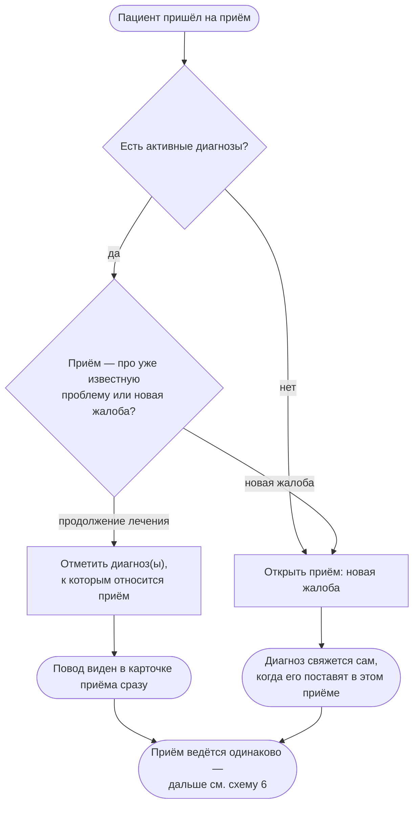
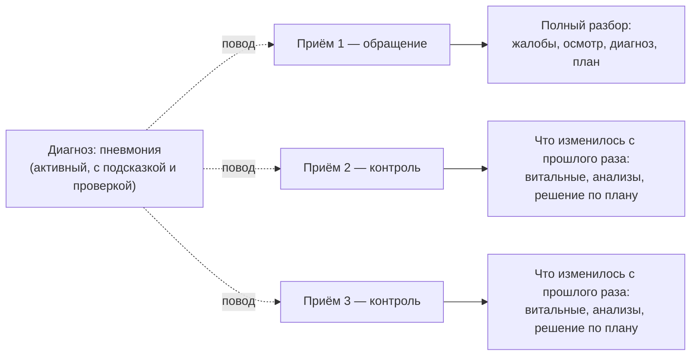

# 7. Повод приёма: новая жалоба или продолжение по диагнозу

Схема 3 объяснила, что приём и диагноз — разные объекты с разной жизнью, и под одним диагнозом обычно несколько приёмов. Эта схема — про один конкретный момент: **что происходит при нажатии «Новый приём»**, и почему повторный визит по уже известной проблеме не должен выглядеть так, будто пациент обратился первый раз.

## Как это устроено в похожем медицинском ПО

Везде, где ведётся список проблем пациента (не только у нас), у каждого визита есть явный **повод**: либо это новая жалоба (проблема, которой ещё нет в списке), либо продолжение уже известной проблемы — тогда визит напрямую ссылается на неё. Разделение важно по двум причинам: (1) врачу сразу видно, к какой истории болезни относится сегодняшний визит, не глядя в список записей; (2) от этого зависит, что показывать в самом визите — полный разбор «с нуля» или продолжение уже начатого лечения.

## 7.1 Что выбирает врач при открытии приёма

**Что говорить врачу:**

1. При открытии нового приёма первый вопрос — не «какой это тип приёма» (амбулаторный/стационарный), а **какой у него повод**: продолжение уже известной проблемы или новая жалоба. Это отдельная, более важная развилка.
2. Если у пациента есть активные диагнозы, при открытии приёма показывается список — можно отметить один или сразу несколько. Отметка происходит **до** любого осмотра или назначения: система не ждёт, пока врач заново поставит диагноз, чтобы понять, о чём этот визит.
3. Если ничего не отмечено — это обычная новая жалоба. Диагноз, если он появится в ходе этого же приёма, свяжется с ним автоматически — отдельно отмечать ничего не нужно.
4. **Один приём может продолжать сразу несколько диагнозов** — например, плановый контроль по двум проблемам одновременно. Это нормально и не требует создавать два приёма.

## 7.2 Почему повторный визит — это не «с нуля»

**Что говорить врачу:**

5. Отметка «продолжение по диагнозу» не убирает и не блокирует ни один шаг приёма (осмотр, анализы, назначения остаются доступны) — она только сразу показывает, **какую проблему** ведёт этот визит, вместо пустой карточки без контекста. Заголовок «Жалоба» на повторном визите можно оставить пустым или написать «жалоб нет, контроль» — это не ошибка ввода.
6. Подсказка и проверка по протоколу не начинаются заново на каждом визите — они всегда считаются по **всей истории диагноза** (все приёмы, все результаты), а не только по текущему визиту. Повод приёма — это про то, что **видно врачу на экране**, а не про то, как считается протокол (это не меняется от повода — см. схему 4).
7. Итог такого визита — как и раньше: закрыть приём в конце контакта, и отдельно (не обязательно в тот же день) — разрешить диагноз, когда болезнь клинически закончилась. Это уже показано в схеме 6.

## Полная BPMN-диаграмма (для Camunda)

| Файл | Открыть |
|---|---|
| [`docs/bpmn/encounter-reason-mature.bpmn`](../bpmn/encounter-reason-mature.bpmn) | Camunda Modeler / bpmn.io — см. `docs/explain/README.md` |

## Проверено по коду (не додумано)

- Выбор повода и список активных диагнозов при открытии приёма — макрос `encounter_form` в `templates/patient.html`, поле `reason_condition_ids`.
- Немедленная связь приёма с диагнозом (до постановки диагноза внутри приёма) — `app.py: add_encounter_route` → `fhir_store.link_encounter_condition`, таблица `encounter_reason` (см. `docs/processes/STATUS_SEMANTICS.md` §0).
- Связь «задним числом», если диагноз ставится внутри приёма без предварительной отметки — `fhir_store.add_condition(encounter_id=…)`.
- Подсказка/проверка считаются по всей истории диагноза, а не по одному приёму — `protocol_cap.evaluate_cap`, `protocol_dispatch.patient_verdicts` (не привязаны к текущему приёму).
