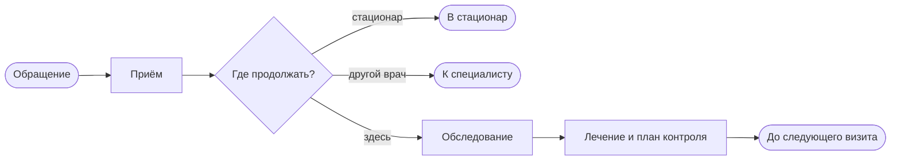
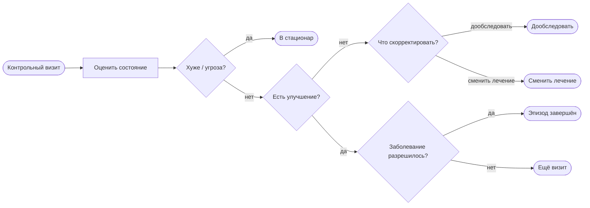

# Processes BPMN — как двигается ведение пациента

Картинки — в `docs/bpmn/*.bpmn` (Camunda Modeler или [bpmn.io](https://demo.bpmn.io/)).  
Шаги и условия в данных — `docs/processes/process_registry.yaml`.

**Главное для показа врачам — только эти два файла:**  
`care-outpatient-mature.bpmn` и `care-outpatient-control-mature.bpmn`.  
В них **нет** конкретных диагнозов на шагах.  
Клинические протоколы **проверяют** назначения в приложении; `cap-*` / `ida-*` — справочные протокольные карты, не рассказ про путь пациента.

Как читать: наверху — **фазы** (подпроцессы). Двойной клик — шаги внутри. Это не инструкция по полям карты.

**Если схема превращается в паутину — дробим.** Один файл = один понятный кусок без стрелок назад через весь холст.

---

## 1. Амбулаторный визит

Файл: [`docs/bpmn/care-outpatient-mature.bpmn`](../bpmn/care-outpatient-mature.bpmn)

Один визит слева направо. Без петель, без второго старта.

| Ситуация | Как видно |
|----------|-----------|
| Первичный или повторный приход | Один старт «Обращение» (повтор = снова этот процесс) |
| Несколько диагнозов на приёме | Внутри фазы приёма; дальше путь общий |
| Нельзя лечить амбулаторно | → в стационар |
| Нужен другой специалист | → направление |
| Сначала анализы / снимки | Фаза «Обследование» (можно пройти без исследований) |
| Наблюдение без нового лекарства | Внутри «Лечение и план» |
| Назначили, когда вернуться | «Запланировать контроль» → конец визита |

---

## 2. Контроль (отдельный процесс)

Файл: [`docs/bpmn/care-outpatient-control-mature.bpmn`](../bpmn/care-outpatient-control-mature.bpmn)

Решения на контроле — **концы**, не стрелки назад на ту же схему.

| Исход | Что дальше |
|-------|------------|
| В стационар | Handoff в стационарный процесс |
| Дообследовать / сменить лечение / ещё визит | Снова запуск **амбулаторного визита** |
| Эпизод завершён | Закрытие заболевания (≠ закрытие одного приёма) |

Важно врачу: **закрыть сегодняшний приём** и **закрыть заболевание** — разные решения.

---

## Стационар и протокольные диаграммы (вторично)

| Файл | Зачем |
|------|--------|
| `docs/bpmn/cap-inpatient-mature.bpmn` | Стационарный эпизод (пока ещё в разрезе ВП — будет обобщаться отдельно) |
| `docs/bpmn/cap-outpatient-mature.bpmn`, `ida-outpatient-mature.bpmn` | Узкие схемы «как протокол проверяет конкретную болезнь» — **не** главный рассказ про путь пациента |
| `docs/bpmn/diagnosis-cds-mature.bpmn` | Увеличенный узел `Task_Diagnosis` из визита: диагноз + доп. диагноз (провенанс) + несколько протоколов одновременно + жёсткая/мягкая проверка назначения (hard/soft-stop, причина, журнал) + госпитализация + два независимых завершения (закрыть приём / разрешить диагноз). Доктор-версия и разбор по коду: `docs/explain/06-diagnosis-and-checks.md` |

Для объяснения «как может двигаться лечение» открывайте сначала **визит**, потом **контроль**.

---

## Как читать вместе с реестром

1. BPMN — картина движений и развилок.  
2. `process_registry.yaml` — детали шагов, если нужны для внедрения.  
3. Подсказки на карте пациента — живая сверка с протоколами по активным диагнозам.
