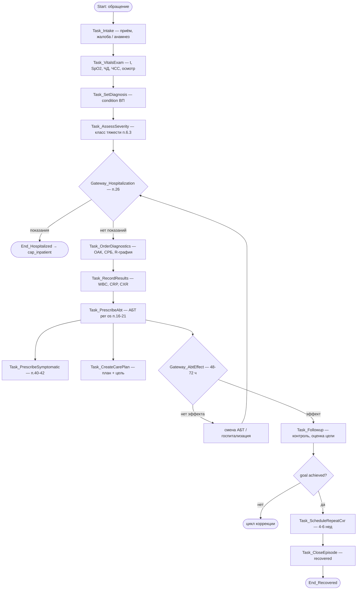
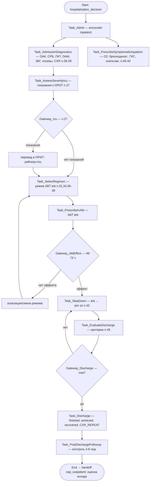

# Processes BPMN — обзор потоков внебольничной пневмонии

Обзор двух процессов КП МЗ РБ №768 (внебольничная пневмония, взрослые) для нетехнической аудитории и быстрой навигации. Картинки — в `docs/bpmn/*.bpmn`. SSOT шагов — `docs/processes/process_registry.yaml`.

## Связь процессов

```
cap_outpatient (амбулаторно)
   │
   ├── decide_hospitalization ──(показания п.26)──► cap_inpatient (стационар)
   │                                                      │
   │ ◄──(выписка, discharge_summary)── discharge ─────────┘
   │
   └── followup_and_outcome ──► close_episode (recovered)
```

Handoff'ы (артефакт + триггер) — в `process_handoffs` YAML.

---

## cap_outpatient — амбулаторный эпизод ВП

Поток (канон YAML / UI): обращение → анамнез → осмотр/измерения → диагноз → сверка с протоколом (тяжесть / госпитализация) → обследование по показаниям → АБТ per os → симптоматика → план/цель → оценка 48–72 ч → контроль → исход → повторная R-графия → закрытие.

> Если `.bpmn` ещё рисует «исследования → диагноз», для автоматизации и UI приоритет у `process_registry.yaml` и `UI_PROCESS_MAP.md`.



Ключевые шлюзы: `Gateway_Hospitalization` (п.26), `Gateway_AbtEffect` (п.15, п.30).

---

## cap_inpatient — стационарный эпизод ВП

Поток: госпитализация → обязательные исследования → оценка тяжести/ОРИТ → выбор режима АБТ в/в → назначение в/в АБТ + симптоматика → оценка 48–72 ч → step-down в/в→per os → критерии выписки → выписка → контроль после выписки.



Ключевые шлюзы: `Gateway_Icu` (п.27), `Gateway_AbtEffect` (п.15, п.30), `Gateway_Discharge` (п.49).

---

## Как читать вместе с YAML

1. Открой Mermaid-схему выше (или `.bpmn` в Camunda Modeler) — общая картина.
2. Для каждого шага открой `process_registry.yaml` → `steps[]` по `id` — `entry_conditions`, `exit_conditions`, `signals`, `data_mapping`, `golden_checks_sql`.
3. Семантика статусов — `STATUS_SEMANTICS.md`.
4. Независимая проверка всей картины — `protocol_cap.evaluate_cap(pid)` (вердикт = single source of truth для CDS и метрики).
5. Сигналы / hard-stop / осознанный override — `docs/processes/CDS_SIGNALING.md` (не путать с «соответствует протоколу»).
