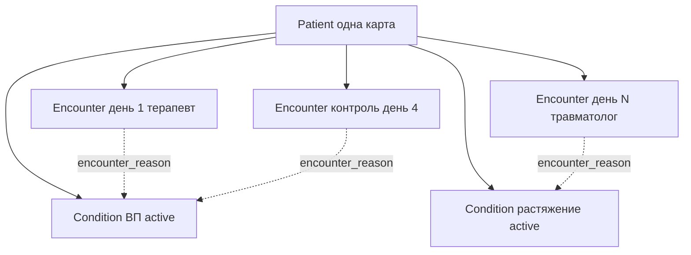

# STATUS_SEMANTICS — семантика статусов и состояний

SSOT семантики для `clinic-os`. Все ссылки в `process_registry.yaml` резолвятся сюда.

> Принцип: **тяжесть и эффективность вычисляются**, а не хранятся как статус. Статусы — только у ресурсов с жизненным циклом (encounter, condition_, medication_request, service_request, care_plan, goal, pathway).

---

## 0. Encounter ≠ Condition — два независимых lifecycle

**Приёмы не лежат внутри диагноза.** У пациента одна карта (`Patient`). Под ней плоско живут:

- несколько **диагнозов** (`condition_`) — каждый со своим жизненным циклом болезни;
- несколько **приёмов** (`encounter`) — каждый = один контакт с врачом.

Связь — таблица `encounter_reason` (M2M, FHIR `reasonReference`): «этот приём относится к этим диагнозам».  
`condition_.encounter_id` — legacy fallback (приём, на котором диагноз поставили), не контейнер для списка приёмов.

В UI под карточкой диагноза виден **фильтр** `encounters` по `condition_id` через `encounter_reason`, не физическая вложенность в БД. Общая хронолента приёмов пациента — тот же источник без фильтра.

**Повод приёма выбирается явно при открытии** (`encounter_form` в `templates/patient.html`, роут `add_encounter_route`), а не додумывается системой:

- врач отмечает 0…N активных диагнозов — «продолжение по диагнозу» → `encounter_reason` пишется **сразу**, до любого назначения/диагноза внутри приёма (аналог FHIR `Encounter.reason.use = Reason for Visit`);
- ничего не отмечено → «новая жалоба» (`Encounter.reason.use = Chief Complaint`); если внутри такого приёма всё же ставится диагноз, связь всё равно появится через `add_condition(encounter_id=…)`.

Без этого шага (до правки) `encounter_reason` заполнялась только при постановке диагноза **внутри** приёма — контрольный визит по уже известному диагнозу физически не отличался от первичного обращения «с нуля» и не попадал в фильтр диагноза. См. `docs/explain/07-encounter-types.md`.

### Два переключателя — врач жмёт в разные моменты

| Что | Когда закрывать | Смысл |
|-----|-----------------|--------|
| **Приём** `encounter.status → finished` | В конце **каждого** контакта | «Сегодня я закончил вести пациента» |
| **Диагноз** `condition_.clinical_status → resolved` | Когда болезнь **клинически** закончилась (часто на контроле) | «Эпизод болезни закрыт» |

Закрытие приёма **не** закрывает диагноз. Под активным диагнозом может быть 1…N закрытых приёмов + один открытый (`in-progress`).

Третий слой (не путать с двумя выше): **эпизод пути** `pathway.state → recovered` — машинный итог курса ВП (цель/выписка); см. §1.

### Сценарии

1. **Одно обращение, несколько визитов (ВП):** один `Condition` (active) → приём 1 → `finished` → приём 2 / контрольный → … → при выздоровлении: `resolved` + pathway `recovered`. Процессы `cap_outpatient` / `cap_inpatient` в `process_registry.yaml` — про **эпизод болезни**, не про один клик «Закрыть приём».
2. **Другая причина, другой врач:** тот же `Patient`; новый `Condition`; новый `Encounter` с другим `practitioner_id` и `encounter_reason` → новый диагноз. Старый диагноз (active) остаётся на первом плане; `resolved` — в истории. При 2+ активных диагнозах — `#triage-panel` (`UI_PROCESS_MAP.md`), чтобы CDS по одному не потерялся среди другого.
3. **Один приём — две жалобы:** один `Encounter`, две строки в `encounter_reason`. Приём виден в фильтре **обоих** диагнозов; дублировать запись не нужно.

### Что делает врач (операционно)

1. Работает в **открытом приёме** (`in-progress`) — туда пишутся осмотр, назначения, исследования.
2. В конце контакта — **Закрыть приём** (админфакт дня).
3. Следит за **активным диагнозом** и CDS/протоколом по нему.
4. Закрывает диагноз (`resolved`) отдельным клиническим решением (обычно когда цель «выздоровление» ясна).
5. Новая проблема → новый диагноз + новый приём; не переиспользовать старый приём другого эпизода.

Термины UI: ambulatory/inpatient → «Приём»; followup → «Контрольный визит» (см. `UI_PROCESS_MAP.md`).

---

## 1. pathway.state — путь пациента (state machine)

| state | label | Смысл | Кто выставляет |
|-------|-------|--------|---------------|
| `screening` | Скрининг | Пациент заведён, диагноза ВП ещё нет | `fhir_store.add_patient` |
| `treatment` | Терапия | Амбулаторное лечение ВП (план создан) | `care_plan_service.create_cap_plan` |
| `inpatient` | Стационар | Госпитализация (encounter class='inpatient') | `care_plan_service.admit_inpatient` |
| `icu` | ОРИТ | Перевод в ОРИТ (п.27) | шаг `transfer_icu` |
| `recovered` | Выздоровление | Эпизод закрыт (цель достигнута) | `care_plan_service.discharge_inpatient` / `evaluate_cap_goal` |
| `adjustment` | Коррекция | Цель не достигнута — цикл коррекции (смена АБТ/госпитализация) | `care_plan_service.evaluate_cap_goal` (not-achieved) |

**Правило:** `recovered` — терминальный статус эпизода. `adjustment` — возврат в цикл лечения (не закрытие).

---

## 2. encounter.status / encounter.class

| class | status | Смысл |
|-------|--------|--------|
| `ambulatory` | `planned` / `in-progress` / `finished` | Амбулаторный приём |
| `inpatient` | `in-progress` / `finished` | Стационарный приём (госпитализация) |
| `followup` | `planned` / `in-progress` / `finished` | Контрольный визит (после выписки / оценка исхода) |

- `in-progress` — приём идёт. `finished` — закрыт. `planned` — запланирован (контрольный визит).
- `class='inpatient'` + `status='in-progress'` → `protocol_cap._setting` возвращает `inpatient`.

---

## 3. condition_.clinical_status / verification_status

| clinical_status | Смысл | В UI (бейдж короткий; полный смысл — в title) |
|-----------------|--------|------|
| `active` | Активный диагноз (лечится / наблюдается) | «активный» |
| `resolved` | Эпизод болезни клинически закончился | «закрыт» (title: «Выздоровление · эпизод закрыт»; не «разрешён») |

| verification_status | Смысл |
|---------------------|--------|
| `provisional` | Предварительный |
| `confirmed` | Подтверждённый |

- `rules_engine.has_pneumonia(pid)` проверяет `clinical_status='active'` и `code in PNEUMONIA_CODES`.
- `code` — МКБ-10 (см. `terminology.PNEUMONIA_CODES`).

---

## 4. medication_request.status / route

| status | Смысл |
|--------|--------|
| `active` | Назначение действует |
| `stopped` | Отменено |

| route | Смысл | Где допустимо |
|-------|--------|--------------|
| `oral` | per os | Амбулаторно (первая линия) + step-down в стационаре |
| `iv` | внутривенно | Стационар (старт АБТ, п.31) |
| `im` | внутримышечно | Стационар |
| `inh` | ингаляционно | Бронходилататоры |

- `code` — ATC (J01* — антибиотики, R05CB/R03AC/R03AK/R03DA/H02AB/J05AH — симптоматика).
- Амбулаторно: только `oral` (п.15). Парентеральные (`PARENTERAL_ONLY`) — только стационар.
- Стационар: старт `iv`/`im` (п.31), затем step-down → `oral` (п.43).

### 4.1 CDS override (осознанное назначение)

| Поле | Значения | Смысл |
|------|----------|--------|
| `cds_override` | `0` / `1` | `1` — врач подтвердил soft- или hard-stop на order-sign |
| `cds_override_detail` | TEXT / null | Тексты CDS на момент confirm |

Дополнительно: append-only таблица `cds_override_log` (severity, category, issue_message, reason врача, created_at).

- Soft-stop (протокол): `confirm=1` + `ack=1`; причина опциональна.
- Hard-stop (аллергия): `confirm=1` + обязательный `override_reason`.
- **Не** делает эпизод compliant: `evaluate_cap` по-прежнему даёт gap с пометкой осознанности.
- UI: бейдж «осознанно» в status-strip; вердикт — «АБТ назначена осознанно вне протокола».
- Полная политика: `docs/processes/CDS_SIGNALING.md`.

---

## 5. service_request.status

| status | Смысл |
|--------|--------|
| `active` | Заказан, не выполнен |
| `completed` | Выполнен (результат записан) |
| `cancelled` | Отменён |

- `code` — код исследования (см. `terminology.STUDIES`: CBC, CRP, PCT, CXR, CXR_REPEAT, BLOOD_CULT…).

---

## 6. care_plan.status / goal.status

| care_plan.status | Смысл |
|------------------|--------|
| `active` | План действует |
| `suspended` | Приостановлен |
| `completed` | План завершён |

| goal.status | Смысл |
|-------------|--------|
| `in-progress` | Цель в работе |
| `achieved` | Достигнута (выздоровление) |
| `not-achieved` | Не достигнута (цикл коррекции) |

- Цель ВП — «клиническое выздоровление»: нормотермия, SpO2 ≥ 95, нормальный ЧД (п.49).
- `evaluate_cap_goal` сравнивает последние observation с критериями и выставляет `achieved` / `not-achieved`.

---

## 7. observation / diagnostic_report

Статуса жизненного цикла нет (только `status` результата: `final`/`partial`/`registered`). Это **факты**, а не состояния:
- `observation` — числовые показатели (LOINC: TEMP/SPO2/RR/HR/WBC/CRP/PCT).
- `diagnostic_report` — текст-заключения (CXR, CT, US, ЭКГ).

---

## 8. clinical_flag

Универсальный структурированный признак (булев/категориальный), которого нет в числовых observation:
социальные факторы риска, локальные знаки при осмотре, бронхообструкция, подозрение на аспирацию/грипп/MRSA,
осложнения, статус вакцинации. Ключи — фиксированные строки (`terminology.CLINICAL_FLAGS`).

- Влияет на: выбор АБТ, показания к госпитализации/ОРИТ, проверку симптоматики (`protocol_cap`).
- `value` — `"true"`/`"false"` или категория; `category` — `social_risk|exam|context|complication|vaccination`.

---

## 9. allergy_intolerance.reaction_type

| reaction_type | Смысл | Влияние на АБТ |
|---------------|--------|----------------|
| `ige` | IgE-опосредованная (анафилаксия/крапивница) | β-лактамы противопоказаны → макролид (п.19) |
| `non-ige` | не-IgE (сыпь/другое) | цефуроксим осторожно (п.21) |
| `unknown` | тип не установлен | трактуется как IgE (перестраховка) |

- `fhir_store.betalactam_allergy_type(pid)` определяет тип по `allergy_intolerance` с β-лактамным `code`/`display`.
